# Python 3주차 정규 과제 

📌Python 정규과제는 매주 정해진 분량의 『*파이썬 라이브러리를 활용한 데이터 분석*』 을 읽고 학습하는 것입니다. 이번주는 아래의 **Python_3rd_TIL**에 나열된 분량을 읽고 공부하시면 됩니다.

아래의 문제를 풀어보며 학습 내용을 점검하세요. 문제를 해결하는 과정에서 개념을 스스로 정리하고, 필요한 경우 참고 자료를 통해 보완하는 것이 좋습니다.

**교재 실습 예제 파일은 07_Python_Template 레포지토리의 notebooks 폴더에 업로드되어 있습니다.**

**👀(수행 인증샷은 필수입니다.)** 

## Python_3rd_TIL

### 4장 넘파이 기본: 배열과 벡터 연산
#### 1. 다차원 배열 객체 ndarray
#### 2. 난수 생성
#### 3. 유니버설 함수: 배열의 각 원소를 빠르게 처리하는 함수
#### 4. 배열을 이용한 배열 기반 프로그래밍
#### 5. 배열 데이터의 파일 입출력
#### 6. 선형대수
#### 7. 계단 오르내리기 예제
#### 8. 마치며 


## Study Schedule

| 주차  | 공부 범위     | 완료 여부 |
| ----- | ------------- | --------- |
| 1주차 | p.25~82    | ✅         |
| 2주차 | p.83~129   | ✅         |
| 3주차 | p.131~179  | ✅         |
| 4주차 | p.181~246 | 🍽️         |
| 5주차 | p.247~309 | 🍽️         |
| 6주차 | p.310~379 | 🍽️         |
| 7주차 | p.381~465 | 🍽️         |


<br>

<!-- 여기까진 그대로 둬 주세요-->

---

# 1️⃣ 학습 내용 정리

## 1. 다차원 배열 객체 ndarray

### 개념정리

ndarray =  N차원의 배열 객체. ndarray는 파이썬에서 사용 할 수 있는 대규모 데이터셋을 담을 수 있는 빠르고 유연한 자료구조. ndarray는 같은 종류의 데이터를 담을 수 있는 포괄적인 다차원 배열이다. 즉, ndarray의 모든 원소는 같은 자료형이어야 한다.
ndarray 배열을 생성하는 가장 쉬운 방법은 array 함수를 이용하는 것

### 실습 인증

<!-- 예제 실습을 진행한 후, 실행 화면을 2-3장 캡쳐하여 제출해주세요. -->

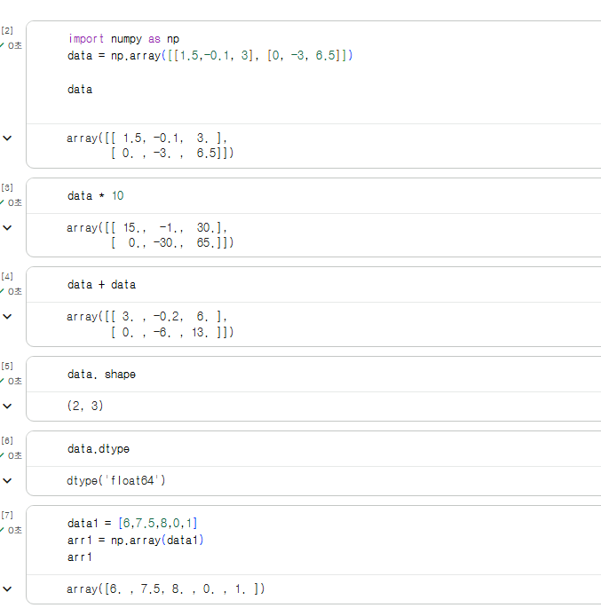
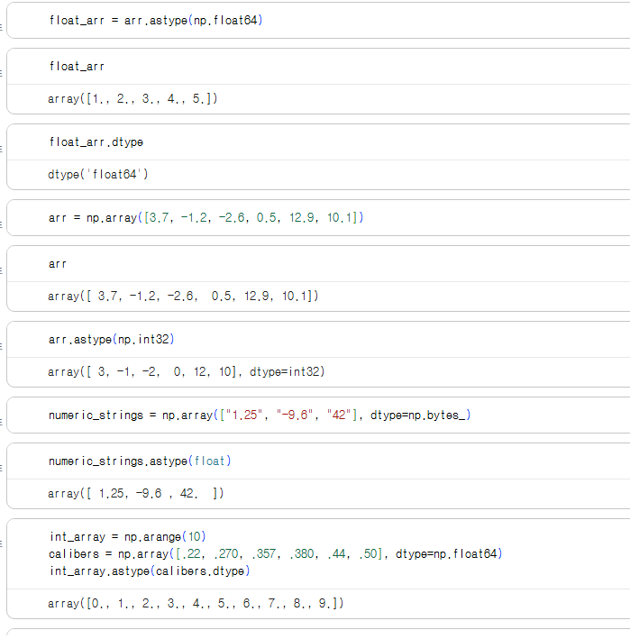

## 2. 난수 생성

### 개념정리

numpy. random 모듈은 파이썬 내장 random 모듈을 보강해 다양한 종류의 확률분포로부터 효 
과적으로 표본값을 생성하는 데 주로 사용한다. 

난수는 엄밀하게 말하자면 진정한 난수가 아니며 유사난수 개념임(난수 생성기의 시드seed 값에 따라 
정해진 난수를 알고리듬으로 생성하기 때문)

### 실습 인증

<!-- 예제 실습을 진행한 후, 실행 화면을 2-3장 캡쳐하여 제출해주세요. -->

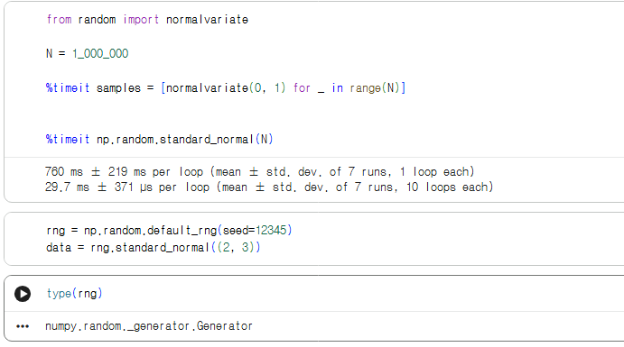


## 3. 유니버설 함수: 배열의 각 원소를 빠르게 처리하는 함수

### 개념정리

ufunc라고도 부르는 유니버설universal 함수는 ndarray 안의 데이터 원소별로 연산을 수행하는 
함수다. 유니버설 함수는 하나 이상의 스칼라 값을 받아서 하나 이상의 스칼라 결괏값을 반환 
하는 간단한 함수를 빠르게 수행하는 벡터화된 래퍼 함수라고 생각하면 됨.

### 실습 인증

<!-- 예제 실습을 진행한 후, 실행 화면을 2-3장 캡쳐하여 제출해주세요. -->

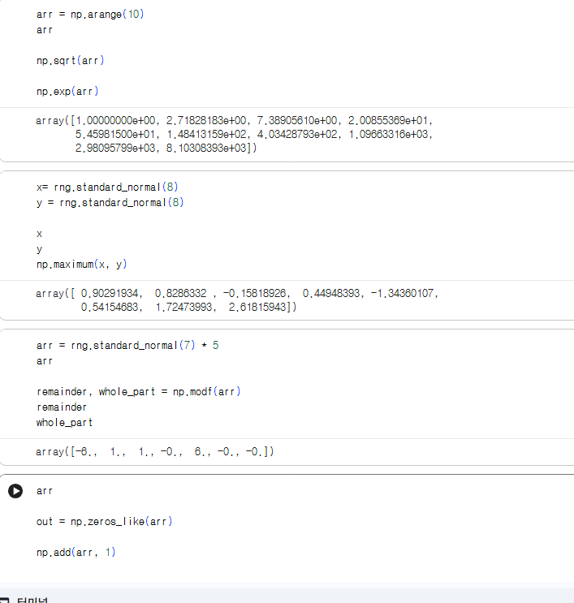


## 4. 배열을 이용한 배열 기반 프로그래밍

### 개념정리

넘파이 배열을 사용하면 반복문을 작성하지 않고 간결한 배열 연산을 통해 많은 종류의 데이터 
처리 작업을 할 수 있다. 배열 연산을 사용해서 반복문을 명시적으로 제거하는 기법을 흔히 벡 
터화라고 부르는데, 일반적으로 벡터화된 배열에 대한 산술 연산은 순수 파이썬 연산에 비해 
2〜3배에서 많게는 수십, 수백 배까지 빠르며 이를 배열 기반 프로그래밍이라고 부를 수 있다.

### 실습 인증

<!-- 예제 실습을 진행한 후, 실행 화면을 2-3장 캡쳐하여 제출해주세요. -->

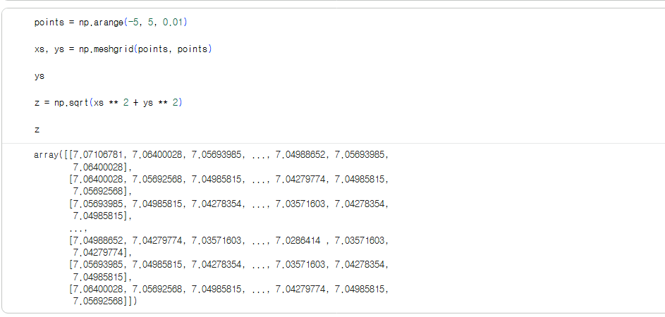
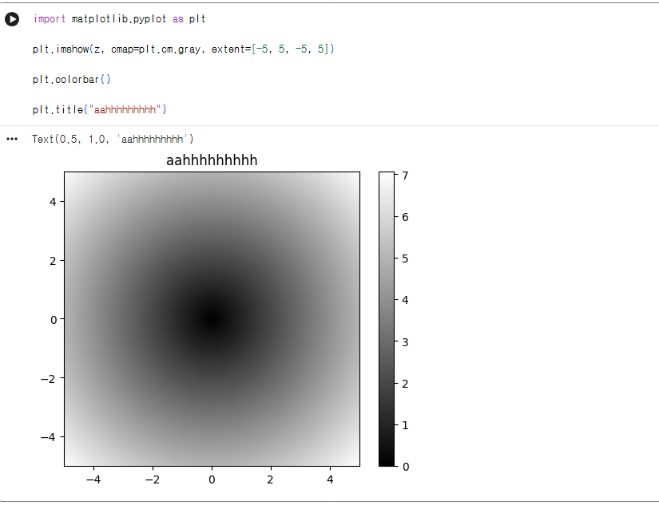


## 5. 배열 데이터의 파일 입출력

### 개념정리

numpy.save와 numpy.load는 배열 데이터를 효과적으로 디스크에 저장하고 불러오는 함수 
다. 배열은 기본적으로 압축되지 않은 원시 바이너리 형식의 .npy 파일로 저장된다.
저장되는 파일 경로가 .npy로 끝나지 않으면 자동적으로 확장자가 추가된다. 이렇게 저장된 
배 열은 numpy. load를 이용해 불러옴.
numpy.savez 함수를 이용하면 여러 개의 배열을 압축된 형식으로 저장할 수 있다. 저장하려 
는 배열은 키워드 인수 형태로 전달한다.

### 실습 인증

<!-- 예제 실습을 진행한 후, 실행 화면을 2-3장 캡쳐하여 제출해주세요. -->

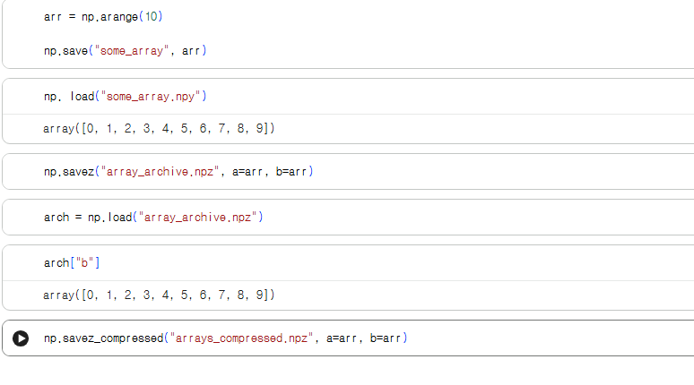


## 6. 선형대수

### 개념정리

행렬의 곱셈, 분할, 행렬식, 정사각행렬 계산 같은 선형대수는 배열을 다루는 라이브러리에서 
매우 중요한 부분임. 행렬의 곱을 하고 싶을 땐, *이 아닌 넘파이 네임스페이스 안에 있는 함수인 dot 함수를 이용해 행렬 곱셈을 계산해야 함.

### 실습 인증

<!-- 예제 실습을 진행한 후, 실행 화면을 2-3장 캡쳐하여 제출해주세요. -->

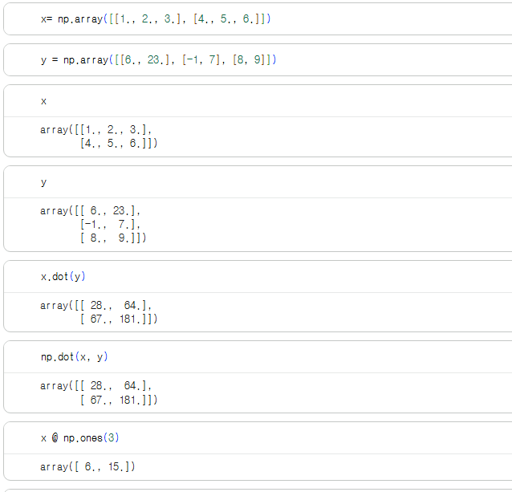
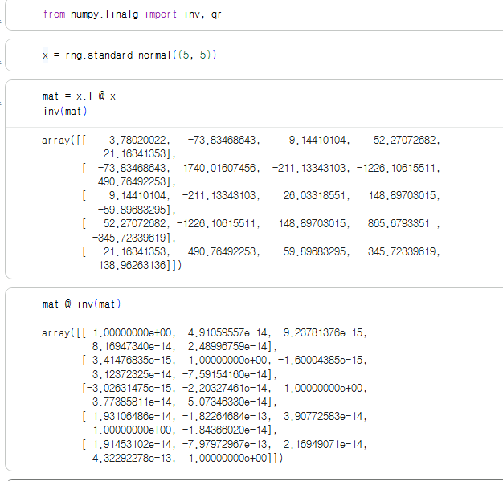

## 7. 계단 오르내리기 예제

### 개념정리

계단 오르내리기 예제 1 는 배열 연산의 활용법을 보여주는 간단한 애플리케이션이다. 
계단의 중간에서 같은 확률로 한 계단 올라가거나(+1)내려간다고(-1)가정.

### 실습 인증

<!-- 예제 실습을 진행한 후, 실행 화면을 2-3장 캡쳐하여 제출해주세요. -->

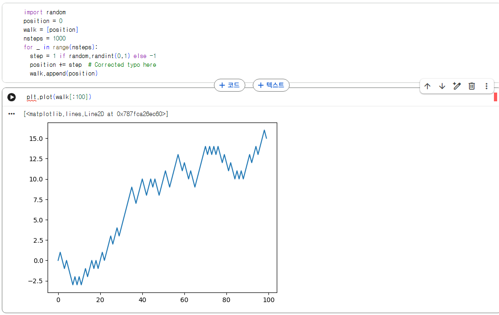
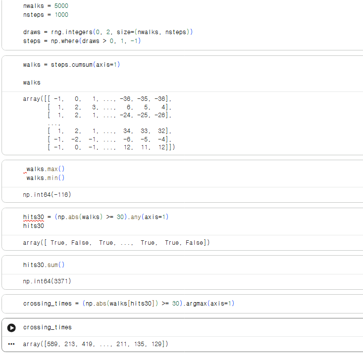


# 2️⃣ 실습 과제

각 문제에 대한 실행 결과가 확인되도록 코드를 작성하고 실행한 뒤, **모든 문제의 실행 화면을 캡처하여 제출하시기 바랍니다.**

**1. 아래 코드를 실행하여 5일간 3개 품목의 판매량 데이터를 생성합니다.**
```python
import numpy as np

# 5일간 3개 품목의 판매량
# 행: 월, 화, 수, 목, 금 / 열: 사과, 배, 포도
sales = np.array([
    [45, 30, 75],  # 월요일
    [50, 60, 15],  # 화요일
    [85, 20, 40],  # 수요일
    [30, 90, 55],  # 목요일
    [70, 45, 80]   # 금요일
])
```

**2. 문제**
```
1. 품목별 총 판매량 계산 및 출력
  - 문제 설명: 각 품목이 5일 동안 총 몇 개 팔렸는지 계산
  - sum() 메서드의 axis 옵션을 활용하여 품목별 합계를 구하세요.
  - print()를 이용해 품목별 총 판매량 리스트를 출력하세요.

2. 특정 기간 및 품목 추출
  - 문제 설명: 수요일부터 금요일까지(3~5행), 첫 번째와 두 번째 품목(사과, 배)의 판매량만 따로 보기 
  - 배열 슬라이싱을 사용하여 해당 데이터를 추출하세요.
  - print()를 이용해 추출된 3x2 배열을 출력하세요.

3. 목표 미달 판매량 조정
  - 문제 설명: 하루 판매량이 40개 미만인 경우, 값을 0으로 표시하고, 40개 이상인 경우는 기존 값을 유지
  - np.where() 함수를 사용하여 40 미만은 0, 40 이상은 원래 값을 가지는 새로운 배열을 만드세요.
  - print()를 이용해 수정된 배열을 출력하세요.
```

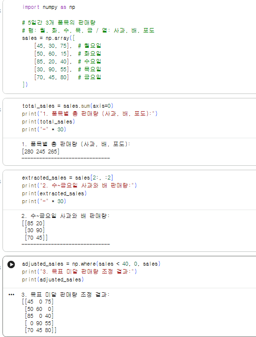


### 🎉 수고하셨습니다.


